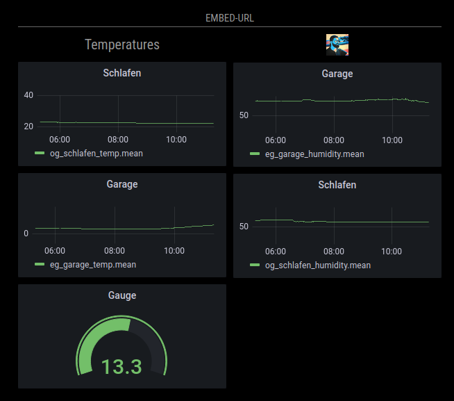

# MMM-EmbedURL

This is a MagicMirror² module which embeds other websites either by "iframe" (default), "webview" or a custom HTML-element to your mirror.
Multiple pages can be embeded at once and the pages can be refreshed periodically (all websites get refreshed at the same time).
As "webview" usage is possible (only if electron browser is used) even pages that forbid embedding by "iframe" can be embedded (i.e. NodeRed Dashboard).

I use it to embed my Grafana panels, my NodeRED-Dashboard and a Webpage with a Live-Webcam to my mirror.


## Basic features

* Embed other websites either by "iframe", "webview" or a custom tag
* Add [Fontawesome 4.7](https://fontawesome.com/v4/icons/) or [Iconify](https://icon-sets.iconify.design/) icon(s) or title(s) before or after the embeded website (position can be configured)
* Set different attributes for the elements by nesting
* Periodically refresh the embedded websites (all sites will be refreshed at once)
* Display embeded elements depending to the current profile (see [MMM-ProfileSwitcher](https://github.com/tosti007/MMM-ProfileSwitcher))

## Basic installation

```bash
cd ~/MagicMirror/modules
git clone https://github.com/Tom-Hirschberger/MMM-EmbedURL
cd MMM-EmbedURL
npm install
```

## Basic configuration

Add the following code to your \~/MagicMirror/config/config.js:

```js
{
  module: "MMM-EmbedURL",
  position: "top_center",
  header: "Embed-URL",
  config: {
    updateInterval: 120,
    attributes: [
        "frameborder=0",
    ],
    embed: [
        "https://magicmirror.builders/",
        "https://www.youtube.com/embed/dIHr96KqfDI"
    ]
  },
},
```

In this a very basic example with the following result:

* The module will be included at the "top\_center" position
* The header text of the module is "Embed-URL"
* All embeded pages will be refreshed every 120 seconds
* All embeded pages will get the attribute "frameborder=0" set
* Two pages will be embedded

## Embed sites that forbid embedding and Cookie banners

If the site(s) you want to embed forbid the embedding by setting some headers there are multiple ways them embed them anyway.

**PLEASE RESPECT THE CONTENT POLICY OF THE PAGES YOU ARE EMBEDDING!**

As most of the pages forbid embeding only to avoid Cross-Site-Scripting attacks and these are very unlikly at the mirror i will show some ways the embed pages that forbid embedding anyway.

There are extensions for at least Firefox, Chrome and Chromium to remove Cookie banners as well.

### Webview usage

If do use the build in electron browser to view the mirror you can use [Webview](https://www.electronjs.org/docs/latest/api/webview-tag) instead. Webview is a little bit slower than IFrame but it ignores the forbid to embed flag. YEEEAAAH!

**To activate Webview you need to weaken the security settings of electron!**

You can do that by adding:

```js
  electronOptions: {
    webPreferences: {
      webviewTag: true,
    }
  },
```

to your general configuration in your "config.js" file.

The start of the file then will look something like:

```js
/* MagicMirror² Config Sample
 *
 * For more information on how you can configure this file
 * see https://docs.magicmirror.builders/configuration/introduction.html
 * and https://docs.magicmirror.builders/modules/configuration.html
 */
let config = {
  electronOptions: {
    webPreferences: {
      webviewTag: true,
    }
  },
  address: localhost
```

You then need to set the "embedElementType" to "webview" in the module configuration.

:warning: Make sure to set "basicElementType" to "div" and not "span". "div" is default as of version 0.0.4 of the module.

**As of MagicMirror² version 2.22.0 you can use Iframe to embed the site and set the two config options:**

```js
/* MagicMirror² Config Sample
 *
 * For more information on how you can configure this file
 * see https://docs.magicmirror.builders/configuration/introduction.html
 * and https://docs.magicmirror.builders/modules/configuration.html
 */
let config = {
  ignoreXOriginHeader: true,
  ignoreContentSecurityPolicy: true,
```

### Firefox browser

You can use the [Requestly Extension](https://requestly.io/blog/bypass-iframe-busting-header/) which is able to remove the headers that prevent sites of being embedded! You then can use a iframe to embed the site.

If the site uses a cookie banner you want to hide you may look at the [Super-Agent Extension](https://addons.mozilla.org/de/firefox/addon/super-agent/) which does the job even in iframes!

### Chrome and Chromium browser

You can use the [Requestly Extension](https://requestly.io/blog/bypass-iframe-busting-header/) which is able to remove the headers that prevent sites of being embedded! You then can use a iframe to embed the site.

If the site uses a cookie banner you want to hide you may look at the [I-Dont-Care-About-Cookies Extension](https://chrome.google.com/webstore/detail/i-dont-care-about-cookies/fihnjjcciajhdojfnbdddfaoknhalnja) which does the job even in iframes!

## General options

:warning: The default "basicElementType" changed with version 0.0.4 from "span" to "div" cause webview does not work with "span" properly.

| Option | Description | Type | Default |
| ------ | ----------- | ---- | ------- |
| updateInterval | The websites will be refreshed in this interval provided in seconds. Set the value to 0 or lower to disable automatic refresh. | Integer | 60 |
| updateDomOnResume | The module updates all embeded elements if it gets resumed in the default configuration. If you do not want this behavior but wait for the `updateInterval` instead set this option to `false` | Boolean | true |
| animationSpeed | The creation of the elements will be animated with this speed in milliseconds. | Integer | 500 |
| embedElementType | The websites will be embeded with this html element. | String | "iframe" |
| basicElementType | The wrappers use this type of html element. | String | "div" |
| positions | The elements will be added in the order of the characters in this string (i=icon, t=title, e=embeded). | String | "tie" |
| attributes | This is a array with additional attributes that should be added to the embeded html element. | Array of Strings | [<br>"frameborder=0"<br>] |
| appendTimestamp | If this option is set to `true` a timestamp is added to each URL that is embedded. This is to avoid caching issues. | Boolean | false |
| title | Either a single String or a Array of String that will be added as title. It is supported to add html tags to the title! | String | null |
| fontIcon | A single String or a Array of String containing the [Fontawesome 4.7](https://fontawesome.com/v4/icons/) or [Iconify](https://iconify.design/) class definition of icons (i.e. "fa fa-tint" or "fluent-emoji-flat:test-tube"). | Array or single String | null |
| imgIcon | If you want to use a image as icon instead of [fontawesome 4.7](https://fontawesome.com/v4/icons/) icons you can specify a single URL or a Array of URLs with this option. **If both fontIcon and imgIcon are specified the imgIcon will be used!** | Array or single String | null |
| classes | A String containing html classes that should be added to the wrappers. If you use multiple instances of the module you can style them differently this way. | String | null |
| imgDecodeCheckInterval | If a value higher than 0 is set the module checks the content of all "img" embed elements to be decodeable. If the content is not decodeable the URL gets reset. | Integer | -1 |
| embed | Either a single URL as String or a Array containing Strings and/or more embed objects (see next section for more information). | Array or single String | null |

## The embed array

The module supports multiple ways to specify the websites you want to integrate. The embed array can contain either Strings or objects. The objects can contain the same options "positions", "attributes". "title", "fontIcon", "imgIcon", "classes", "embedElementType" and "embed" as in the main configuration. It is possible to nest the embed objects this way and configure different options for them.

Additionally the "profile" option can be used to set a space separated String of profiles in which this elements should be displayed.

**If no positions, attributes or imgDecodeCheckInterval values are defined in the embed array but in the main configuration the ones in the main configuration will be used!**

Lets look at a bigger example:

```js
{
 module: "MMM-EmbedURL",
 position: "top_center",
 header: "Embed-URL",
 config: {
  updateInterval: 30,
  classes: "extraClassOne extraClassTwo",
  embed: [
   "https://magicmirror.builders/",
   {
    title: "Dummy1",
    profiles: "pageR1 pageL1",
    attributes: [
     "frameborder=0",
     "allowfullscreen",
     "allow=accelerometer; autoplay; clipboard-write; encrypted-media; gyroscope; picture-in-picture"
    ],
    embed: [
     "https://www.youtube.com/embed/dIHr96KqfDI?autoplay=0",
     "https://dummy:3000/temperaturen?orgId=2&from=1666840667772&to=1666862267772&panelId=4",
    ]
   },
   {
    title: ["Dummy2", "Dummy2-2"],
    fontIcon: "fa fa-tint",
    profiles: "pageR2",
    positions: "ite",
    embed: [
     "https://dummy:3000/temperaturen?orgId=2&from=1666840667772&to=1666862267772&panelId=4",
     "https://dummy:3000/temperaturen?orgId=2&from=1666840776401&to=1666862376402&panelId=2",
     "https://dummy:3000/temperaturen?orgId=2&from=1666840963687&to=1666862563687&panelId=6"
    ]
   },
   {
    imgIcon: "./modules/MMM-EmbedURL/icons/tom.jpg",
    classes: "dummy3 myDummy",
    embedElementType: "webview",
    appendTimestamp: true,
    embed: [
     "https://dummy:3000/humidity?orgId=2&from=1666840580521&to=1666862180521&panelId=4",
     "https://dummy:3000/humidity?orgId=2&from=1666840621970&to=1666862221970&panelId=2",

    ]
   },
  ]
 },
 classes: "pageC pageL1 pageR1 pageR2"
},
```

The following happens in this example:

* The module is only visible if profile "pageC", "pageL1", "pageR1" or "pageR2" is active
* The MagicMirror² page will be added in a iframe
* Three embed objects are created
* Each element and all wrappers get the extra classes "extraClassOne" and "extraClassTwo" added
* The first object:
    * Defines a single title ("Dummy1") and is only visible if profile "pageR1" or "pageL1" is active
    * Defines other attributes than the default ones
    * Addes two elements: A video of youtube and a dummy
* The second object:
    * Defines two titles "Dummy2" and "Dummy2-2" and is only visible if profile "pageR2" is active
    * Defines a fontIcon
    * Addes three dummy elements
    * The icon should be added first, after it th title followed by the embeded websites
* The third object
    * Is visible at all profiles
    * Defines a image icon
    * Adds two dummy elements but not uses the default "iframe" element to embed but "webview" instead
    * All elements get the css classes "dummy3" and "myDummy" added
    * All URLs get the current timestamp appended when added (i.e. `https://dummy:3000/humidity?orgId=2&from=1666840621970&to=1666862221970&panelId=2&timestamp=12345678`)

If you think about the dummy URLs look a little bit like URLs of Grafana panels you are right. I use the module to show my Grafana charts. Examples of how to setup InfluxDB and Grafana are included in the [doc](doc) directory!

## Styling

The module uses flexbox layout and all styling is done via css. Even the size of the embeded elements is controlled via css.
All wrappers get default classes added additional classes can be configured with the options described above.
The class "embed" will be added to the root wrapper!

Look at the [embedURL.css](embedURL.css) file for inspiration but override and style in your "custom.css"!

The size of the embeded elements is controlled in example with:

```css
.MMM-EmbedURL .embed .embeded {
    width: 800px;
    height: 400px;
}
```

If you want to display i.e. a color inverterted version of the page you can add the following to your "custom.css":

```css
.MMM-EmbedURL .embed .embeded {
    filter: invert(100%);
}
```

I included a example of viewing a [webcam](doc/screenshots/webcam.png) showing how to embed it and move the position to hide the menu and footer. Look at the corresponding [config](doc/configs/webcam-config.js) and [css](doc/configs/webcam-custom.css) for more details.

## Developer commands

* `npm install` \- Install devDependencies like ESLint\.
* `npm run lint` \- Run linting and formatter checks\.
* `npm run lint:fix` \- Fix linting and formatter issues\.